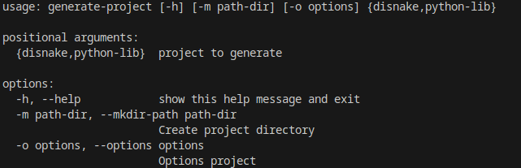

# generate-base-projects
Консольная утилита для генерации основ ваших проектов.<br>
### Примеры:
- **disnake** - папка правил генерации базового проекта дискорд бота (библиотека: Disnake)
- **python-lib** - папка правил генерации базового проекта python библиотеки

## Как использовать
Для создания своих правил для проекта нужно:
- Создать папку с названием вашего проекта в директории данного проекта
- В папке с вашими правилами создать settings.json
```json
{
    "create-venv": true, // Для Python проектов: нужно ли создать виртуальное окружение
    "requires": [ // Для Python проектов: название стороних библиотек, которые должны будут входить в ваш проект
        "setuptools"
    ],
    "options": { // Опции, которые нужно будет указать при вызове команды для генерации данного правила
        "name": "<name>", // name - ключ, который будет использоваться для присваивания; <name> - значение, которое будет заменено на ваше
        "requires": "<requires>" // Это так же будет работать и в файлах примерах
    },
    "folders": [ // Список папок в проекте
        {
            "name": "<name>", // Название папки
            "files": [ // Список файлов
                {
                    "name": "__init__.py", // Название файла
                    "content": "# Это __init__.py" // Содержимое файла
                }
            ]
        },
        {
            "name": "tests",
            "files": [
                {
                    "name": "<name>-test.py"
                },
                {
                    "name": "__init__.py"
                }
            ]
        }
    ],
    "files": [ // Список файлов
        {
            "name": "setup.py",
            "example": "setup.example" // Название файла, содержимое которого будет скопировано в этот файл
        }
    ]
}
```
- Готово, пример команды:
```shell
python generate.py python-lib -m test-python-lib -o "name:base-parser;requires:['requests',]"
```

